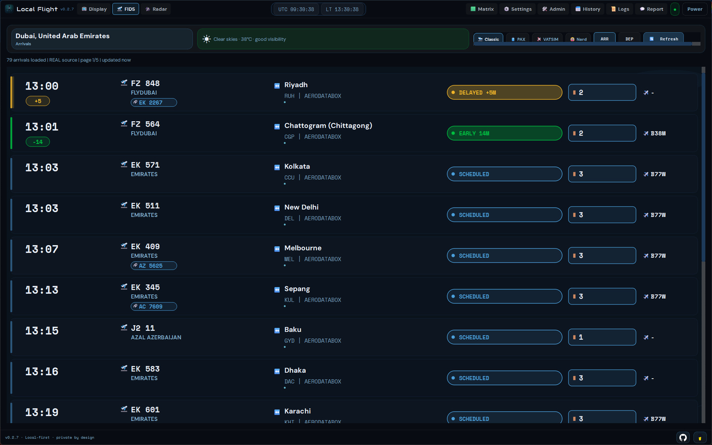
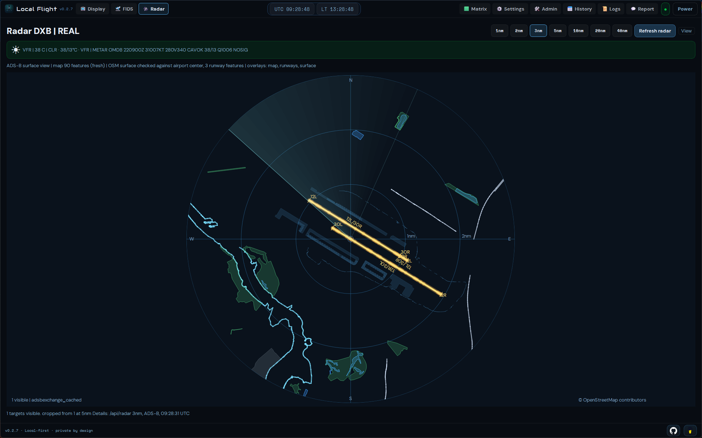
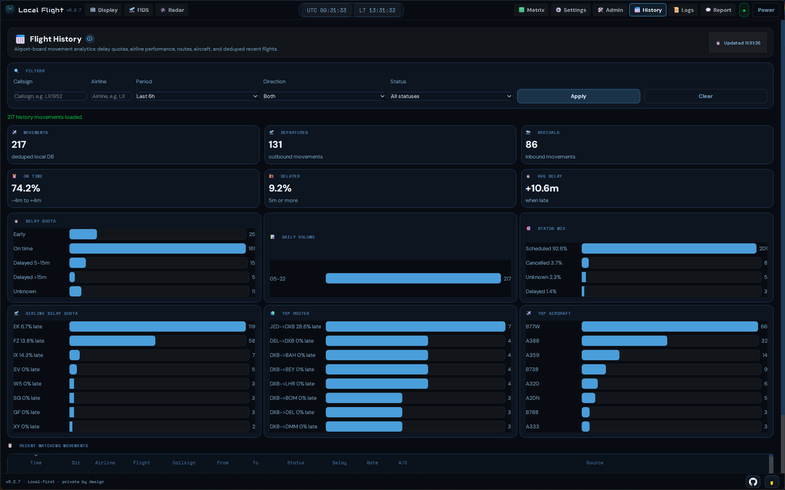
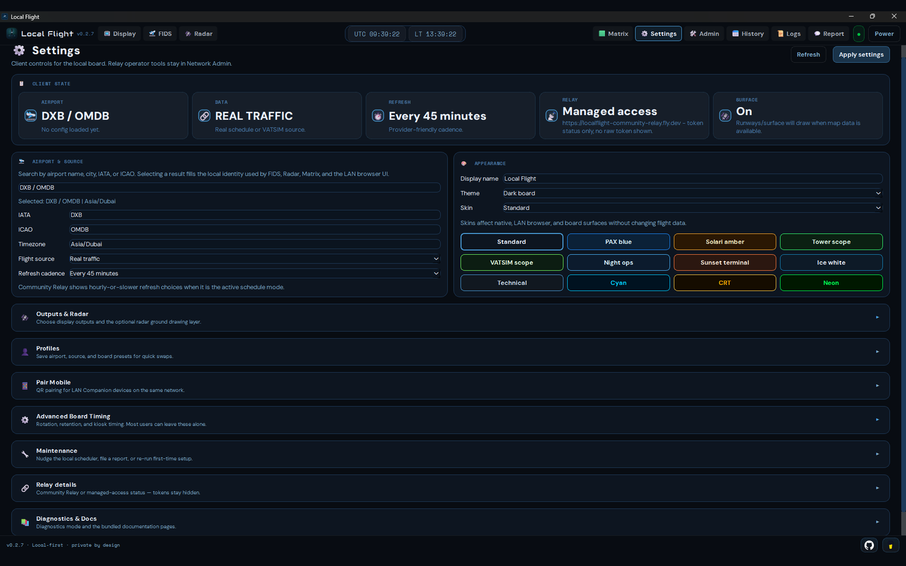
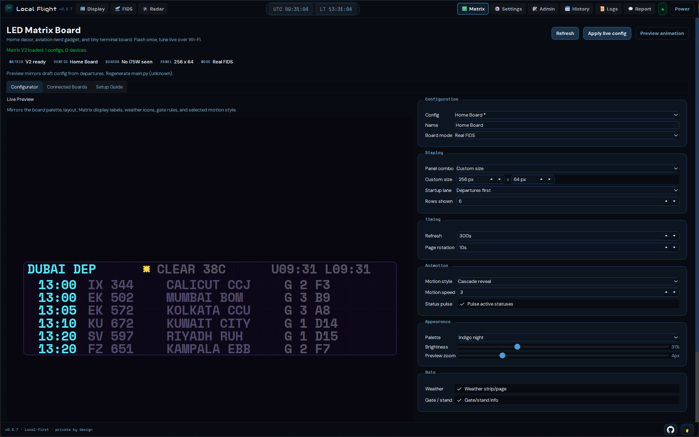
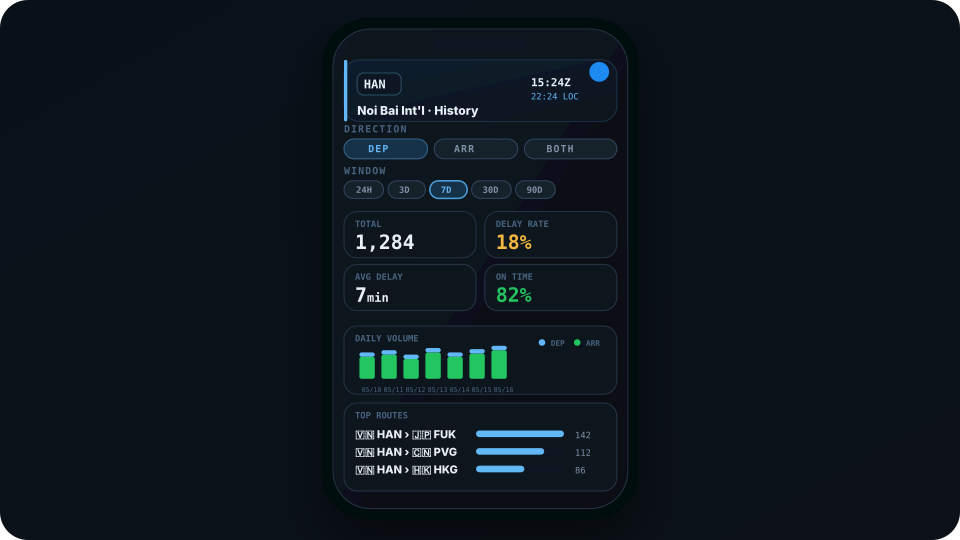

# Local Flight

Local Flight is a local-first Flight Information Display System (FIDS) for Windows, macOS, Raspberry Pi, mobile devices, HDMI displays, LAN browsers, and LED matrix boards.

It fetches real or virtual flight data, keeps a local history, and renders airport-style departures, arrivals, radar, weather, and Matrix feeds without accounts or a signup wall.

The recommended desktop client is now the native Qt app. The LAN browser UI, Pi display modes, Matrix board, and Companion mode all use the same local server underneath, so you can pick the display style that fits your setup without splitting the app into different products. Mobile Companion uses LAN first and can keep working away from Wi-Fi through encrypted Remote Companion when a relay-linked host and paired phone grant are available. The same mobile app can also run in a simplified Standalone mode through the hosted relay when you only want a light phone board.

- **Website:** [beacontools.cc/local-flight](https://beacontools.cc/local-flight)
- **Privacy:** [beacontools.cc/privacy](https://beacontools.cc/privacy)
- **Public relay:** `https://relay.beacontools.cc`
- **Source:** [github.com/tr3y4rch/local-flight](https://github.com/tr3y4rch/local-flight)
- **Support:** [beacontools.cc/support](https://beacontools.cc/support) for messages and bug reports; privacy requests start at [beacontools.cc/privacy/choices](https://beacontools.cc/privacy/choices)

---

## Status

`0.5.1` is the current Local Flight release line for desktop and Raspberry Pi. The same version is in TestFlight and Google Play testing so the mobile clients, relay, and local server stay on one compatibility baseline:

- Native desktop app for Windows and macOS, with four switchable FIDS board styles (Classic / PAX / VATSIM / Nerd) that each render their own design
- LAN browser UI that mirrors the native Qt shell — same nav, same tokens, same components — with an automatic mobile view for phones and a compact layout for 7" Raspberry Pi screens
- Raspberry Pi headless server, native Qt HDMI kiosk, or Chromium HDMI kiosk
- Mobile app with Companion, encrypted Remote Companion fallback for paired relay-linked hosts, and Standalone setup modes. iOS and Android use the same `0.5.1` feature contract during store testing.
- Interstate 75 W / HUB75 Matrix client and preview tools
- Beacon Tools public site and privacy page for release/App Store/TestFlight metadata

---

## Which Path Should I Choose?

| If you want... | Use this |
|---|---|
| The normal desktop app | Native Qt app on Windows or macOS |
| A small always-on home server | Raspberry Pi headless |
| A Pi plugged into an HDMI display | Native Qt kiosk or Chromium kiosk |
| A Pi with a 7" touch screen | LAN browser UI — auto-compacts at 800×480 / 1024×600 |
| Viewing from another device | LAN browser UI at `http://localflight.local:8000` |
| iPhone/iPad/Android controls for your desktop/Pi server, at home or away | Mobile Companion with Remote Companion fallback; see the [mobile page](https://beacontools.cc/local-flight/mobile) |
| A simplified phone board without running your own server | Mobile Standalone; see the [mobile page](https://beacontools.cc/local-flight/mobile) |
| A small LED board | Matrix page + Interstate 75 W client |

Read the detailed guides:

- [Install Guide](docs/install.md)
- [Display Modes](docs/display-modes.md)
- [Privacy & Diagnostics](PRIVACY.md)
- [0.5.1 Release Overview](docs/release-notes-0.5.1.md)
- [Full Changelog](CHANGELOG.md)

Historical release notes remain under [`docs/`](docs/), including the archived `0.2.x` development lines.

---

## What It Does

- Guided setup with **Local Flight Relay**, **Use your own keys**, and **VATSIM** paths
- Real schedule support designed around cached shared snapshots, AeroDataBox primary schedule data, AviationStack sparse fill/fallback compatibility, and stale-safe serving when live providers are slow or capped
- Passenger-style FIDS boards for real-world data with city/country airport headers, arrivals/departures, airport-local time, status/gate chips, codeshare grouping, pinned flights, live refresh, and native Classic/PAX/VATSIM/Nerd board styles
- VATSIM mode uses a pilot/ATC display contract instead of passenger/codeshare fields: callsign-first rows, filed route/flight rules, aircraft, altitude/speed, XPDR, VATSIM freshness, and strict suppression of pilot/controller personal identifiers
- Four switchable FIDS board styles in the native shell — **Classic**, **PAX**, **VATSIM**, **Nerd** — each with its own chrome, palette, column set, status styling, and viewport-aware scaling
- Native Qt dark/reduced-glare and light/high-visibility themes cover pages, dialogs, menus, controls, and all board skins with contrast-checked text and status colors. Windows and macOS also provide a small Local Flight status menu for opening core views, the LAN browser, and app controls.
- Radar with real/VATSIM traffic, METAR weather, range controls, optional runway/surface/map/terrain context, mobile-specific range policies, and richer aircraft/status detail
- Native Qt desktop shell with Display, FIDS, Radar, Matrix, Settings, Admin, History, Logs, Report, and local docs
- Settings page built from clear disclosure cards instead of opaque checkbox-titled groups; the LAN browser Settings page now follows the same folder rhythm and includes Pair Mobile QR/manual pairing controls.
- LAN browser UI for headless installs, remote screens, tablets, phones, and browser-mode displays, with compact layouts for 7" Pi touch screens and browser-side access to the same Companion pairing tools as the Qt shell
- Mobile app with a first-run choice between **Companion** and **Standalone**: Companion focuses on Board, Radar, History, and Control for an existing desktop/Pi host, uses LAN first, and can use encrypted Remote Companion fallback when a relay-linked host grants this phone access. Standalone offers a simpler FIDS/Radar/History/Settings experience through the Beacon Tools relay with slower refreshes and no server-control tools. The mobile shell keeps its own appearance, branded launch overlay, and small native-feeling interactions.
- QR pairing in native and LAN Settings now prefers the actual LAN IP and carries the server fingerprint, so an iPhone or Android phone will not silently connect to a different Local Flight host if `localflight.local` resolves to another Pi/desktop on the same network.
- History dashboard with filters, delay buckets, airline delay quotas, route/aircraft stats, sortable recent movements, and detail panels. Repeated snapshots and known codeshares are deduped so the count means actual movements, not raw board rows.
- Matrix tooling for Interstate 75 W / HUB75 boards, including panel presets, board-mirror preview, optional real-world gate/stand display, compact weather headers, runtime settings, split-flap/typewriter/cascade motion, generated MicroPython `main.py`, and renderer-revision warnings when a board needs a refreshed file.
- Shared flight detail intelligence for FIDS, Radar, History, Matrix, native Qt, and LAN browser views, using current local snapshots, radar data, weather, and history without new per-click provider calls
- Local history, local logs, local settings, install-scoped diagnostics, and Beacon Tools support/privacy contact paths

---

## Preview

These product previews show the native shell and mobile design across FIDS, Radar, History, Settings, and Matrix. They are interface examples, not live operational telemetry.

Open [docs/previews/index.html](docs/previews/index.html) locally for the standalone HTML gallery.

<p align="center">
  
  
</p>

<p align="center">
  
  
</p>

<p align="center">
  
  
</p>

<p align="center">
  
  
</p>

<p align="center">
  
</p>

---

## Quick Install

Use the **Downloads** section at [beacontools.cc/local-flight](https://beacontools.cc/local-flight#downloads) for Windows, macOS, and Raspberry Pi packages. The page links directly to the newest complete files on the official [GitHub Releases page](https://github.com/tr3y4rch/local-flight/releases) and only enables a direct package when its matching SHA256 checksum is present. Until the `0.5.1` packages appear there, use the source/Pi instructions in the [Install Guide](docs/install.md) rather than an older package with the same filename pattern.

### Windows

When published, choose Windows on the website Downloads section to fetch `LocalFlight-0.5.1-Setup.exe` from GitHub, run the wizard, then launch Local Flight from the final installer page, Start Menu, or desktop shortcut.
The release app launches as a branded desktop app without a Python or cmd console window. `LocalFlight-windows.zip` remains available as a portable/manual install artifact.

### macOS

When published, choose macOS on the website Downloads section to fetch the current Apple silicon `LocalFlight-0.5.1-macos.pkg` from GitHub. Open the installer package, complete the macOS installer flow, then launch Local Flight from Applications.
The current package is Developer ID signed and notarized by Apple, so ordinary installs should not require the one-time Finder Open confirmation used by the earlier ad-hoc archive. No Python, Terminal, or source checkout is needed, and Local Flight user data remains in the user folder across upgrades.

### Raspberry Pi

Download the Pi source bundle or clone the repo, then run:

```bash
bash installers/pi/install.sh
```

The Pi installer asks how the Pi should run and defaults to headless.

### Mobile App

Version `0.5.1` is in TestFlight and Google Play testing. Public availability and tester access are listed at [beacontools.cc/local-flight/mobile](https://beacontools.cc/local-flight/mobile). The commands below are for source development, not ordinary installation.

```bash
cd mobile
npm install
npx expo install --fix
npm run verify
npm run ios
```

For Android development builds:

```bash
cd mobile
npm run verify
npm run android
```

For full setup details, see [docs/install.md](docs/install.md).

---

## First Launch

First launch opens setup before the normal app.

Setup guides you through:

1. Welcome
2. Airport
3. Flight data
4. Optional provider keys
5. Diagnostics choice
6. Review and open

Local Flight Relay is the recommended first path. It uses the Beacon Tools relay at `https://relay.beacontools.cc` with cached shared schedule snapshots so many installs can watch the same airport without each one calling a paid provider. Local Flight Relay schedule refresh choices are hourly-or-slower in the client UI; BYOK and VATSIM can still use the standard local refresh choices. BYOK is for users who already have provider keys such as AeroDataBox through API.Market or RapidAPI, AviationStack, RapidAPI ADS-B Exchange, or OpenSky. VATSIM is the no-key virtual traffic path.

---

## Local Data And Privacy

Local Flight stores runtime data under `~/.localflight/`:

- Config
- Snapshots
- History database (deduped movements plus raw local observations for diagnostics)
- Logs
- API usage counters

Manual reports are always user-triggered. Automatic diagnostics require consent and are sanitized before leaving the device. Companion mode requires both the phone-local diagnostics choice and the connected server diagnostics mode to allow automatic reports. Remote Companion relay messages are end-to-end encrypted between the paired phone and host; the relay routes grant refs, request ids, status, latency, and byte sizes, not readable board data or commands. Standalone mobile automatic reports require the phone-local diagnostics choice only, because there is no paired local server in that mode.

See [PRIVACY.md](PRIVACY.md) or the online policy at [beacontools.cc/privacy](https://beacontools.cc/privacy) for the detailed privacy model.

---

## Source Checkout

For development or source testing:

```bash
python -m venv .venv
source .venv/bin/activate
python -m pip install --upgrade pip
python -m pip install -e ".[native]"
cd src
python -m localflight
```

Windows, macOS, and Pi source installers are documented in [docs/install.md](docs/install.md).

---

## Project Philosophy

- **Local first:** your config, snapshots, history, and logs live on your machine.
- **Honest history counts:** History shows deduped flight movements; raw snapshot observations remain local diagnostics instead of inflating the board.
- **No accounts:** Local Flight does not require a login or email address.
- **Native by default on desktop:** the main desktop app does not need a browser profile, webview, online font, CDN, extension, or sync surface.
- **LAN browser UI stays supported:** useful for headless installs, remote viewing, kiosk displays, and recovery.
- **Flexible mobile:** the same mobile app can be a Companion for your desktop/Pi server over LAN or encrypted Remote Companion fallback, or a simplified Standalone relay client with stricter refresh limits.
- **Server-mediated hardware:** Matrix talks through your Local Flight server and never receives provider keys.
- **Budget-aware:** provider and relay usage is cached, tracked, and guarded before paid calls are made.

For display-choice philosophy, see [docs/display-modes.md](docs/display-modes.md).
