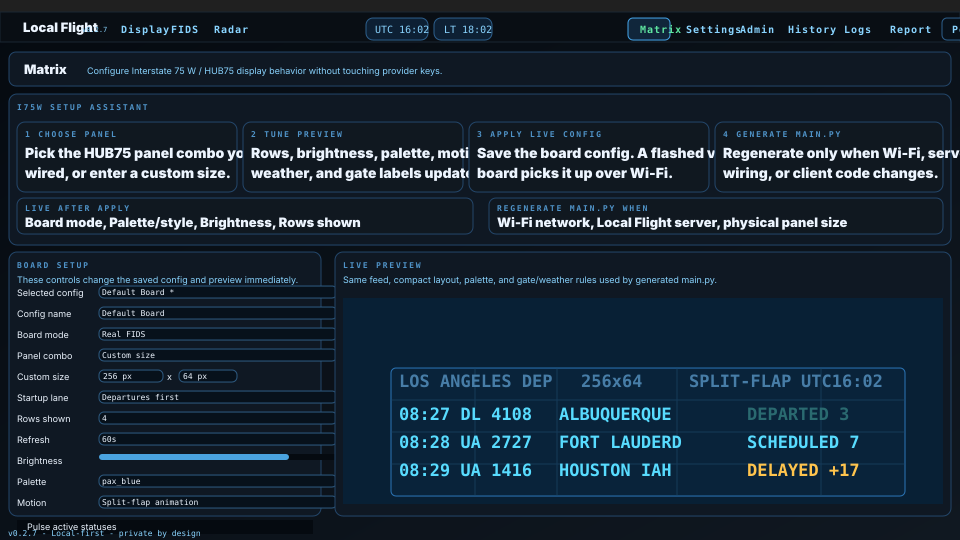

# Local Flight

Local Flight is a local-first Flight Information Display System (FIDS) for Windows, macOS, Raspberry Pi, mobile companion screens, HDMI displays, LAN browsers, and LED matrix boards.

It fetches real or virtual flight data, keeps a local history, and renders airport-style departures, arrivals, radar, weather, and Matrix feeds without accounts or a signup wall.

The recommended desktop client is now the native Qt app. The LAN browser UI, Pi display modes, mobile companion, Matrix board, and local APIs all use the same local server underneath, so you can pick the display style that fits your setup without splitting the app into different products.

**Source:** [github.com/tr3y4rch/local-flight](https://github.com/tr3y4rch/local-flight)

---

## Status

`0.2.6` is the temporary client-polish target after the `0.2.5` beta baseline. It is still beta software, but this pass treats Local Flight as a working multi-client app:

- Native desktop app for Windows and macOS
- LAN browser UI for remote viewing, headless installs, and browser-mode displays
- Raspberry Pi headless server, native Qt HDMI kiosk, or Chromium HDMI kiosk
- iOS-first mobile companion developer preview
- Interstate 75 W / HUB75 Matrix client and preview tools

Package/dependency upgrades are intentionally not part of this docs/copy sweep.

---

## Which Path Should I Choose?

| If you want... | Use this |
|---|---|
| The normal desktop app | Native Qt app on Windows or macOS |
| A small always-on home server | Raspberry Pi headless |
| A Pi plugged into an HDMI display | Native Qt kiosk or Chromium kiosk |
| Viewing from another device | LAN browser UI at `http://localflight.local:8000` |
| iPhone/iPad companion controls | Mobile companion from `mobile/` |
| A small LED board | Matrix page + Interstate 75 W client |

Read the detailed guides:

- [Install Guide](docs/install.md)
- [Display Modes](docs/display-modes.md)
- [Privacy & Diagnostics](PRIVACY.md)
- [Temporary 0.2.6 Client Notes](docs/release-notes-0.2.6.md)
- [Full Changelog](CHANGELOG.md)

---

## What It Does

- Guided setup with **Community Relay**, **Bring your own keys**, and **VATSIM** paths
- Passenger-style FIDS boards with arrivals/departures, airport-local time, status/gate chips, codeshare grouping, pinned flights, and live refresh
- Radar with real/VATSIM traffic, METAR weather, range controls, optional runway/surface/map/terrain context, and richer aircraft/status detail
- Native Qt desktop shell with Display, FIDS, Radar, Matrix, Settings, Admin, History, Logs, Report, and local docs
- LAN browser UI for headless installs, remote screens, tablets, and browser-mode displays
- Mobile companion with first-launch pairing, FIDS, Radar, History, guided Settings, Matrix/Admin entry points, server-mediated docs, and diagnostics consent
- History dashboard with filters, delay buckets, airline delay quotas, route/aircraft stats, sortable recent flights, and detail panels
- Matrix tooling for Interstate 75 W / HUB75 boards, including panel presets, live preview, optional real-world gate/stand display, compact weather headers, runtime settings, and generated MicroPython `main.py`
- Shared flight detail intelligence for FIDS, Radar, History, Matrix, native Qt, and LAN browser views, using current local snapshots, radar data, weather, and history without new per-click provider calls
- Local history, local logs, local settings, and install-scoped diagnostics

---

## Preview

These are lightweight illustrative previews with sample data, not live telemetry screenshots.

Open [docs/previews/index.html](docs/previews/index.html) locally for the standalone HTML gallery.

<p align="center">
  
  
</p>

<p align="center">
  
  
</p>

<p align="center">
  
  
</p>

<p align="center">
  
</p>

---

## Quick Install

### Windows

Download `LocalFlight-windows.zip`, unzip it, and run `LocalFlight.exe`.

### macOS

Download `LocalFlight-macos.zip`, unzip it, drag `LocalFlight.app` to Applications, then right-click **Open** the first time if Gatekeeper warns.

### Raspberry Pi

Download the Pi source bundle or clone the repo, then run:

```bash
bash installers/pi/install.sh
```

The Pi installer asks how the Pi should run and defaults to headless.

### Mobile Companion

```bash
cd mobile
npm install
npx expo install --fix
npm run verify
npm run ios
```

For full setup details, see [docs/install.md](docs/install.md).

---

## First Launch

First launch opens setup before the normal app.

Setup asks for:

1. Airport
2. Data access path
3. Optional provider keys
4. Diagnostics choice
5. Finish confirmation

Community Relay is the recommended first path. BYOK is for users who already have provider keys. VATSIM is the no-key virtual traffic path.

---

## Local Data And Privacy

Local Flight stores runtime data under `~/.localflight/`:

- Config
- Snapshots
- History database
- Logs
- API usage counters

Manual reports are always user-triggered. Automatic diagnostics require consent and are sanitized before leaving the machine. The mobile companion requires both the phone-local diagnostics choice and the connected server diagnostics mode to allow automatic reports.

See [PRIVACY.md](PRIVACY.md) for the detailed privacy model.

---

## Source Checkout

For development or source testing:

```bash
python -m venv .venv
source .venv/bin/activate
python -m pip install --upgrade pip
python -m pip install -e ".[native]"
cd src
python -m localflight
```

Windows, macOS, and Pi source installers are documented in [docs/install.md](docs/install.md).

---

## Project Philosophy

- **Local first:** your config, snapshots, history, and logs live on your machine.
- **No accounts:** Local Flight does not require a login or email address.
- **Native by default on desktop:** the main desktop app does not need a browser profile, webview, online font, CDN, extension, or sync surface.
- **LAN browser UI stays supported:** useful for headless installs, remote viewing, kiosk displays, and recovery.
- **Server-mediated companions:** mobile and Matrix talk through your Local Flight server.
- **Budget-aware:** provider and relay usage is tracked and guarded.

For display-choice philosophy, see [docs/display-modes.md](docs/display-modes.md).
