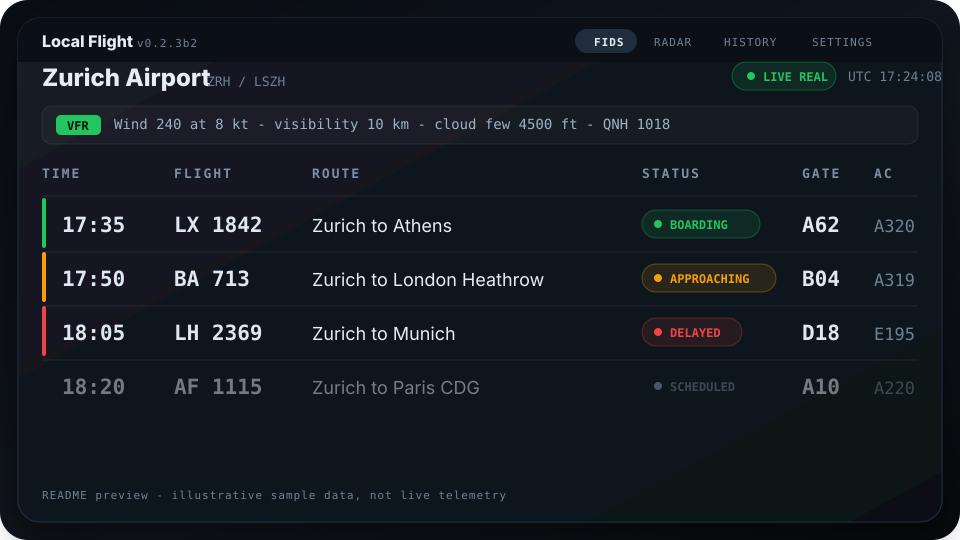
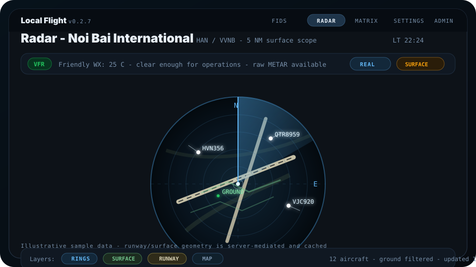
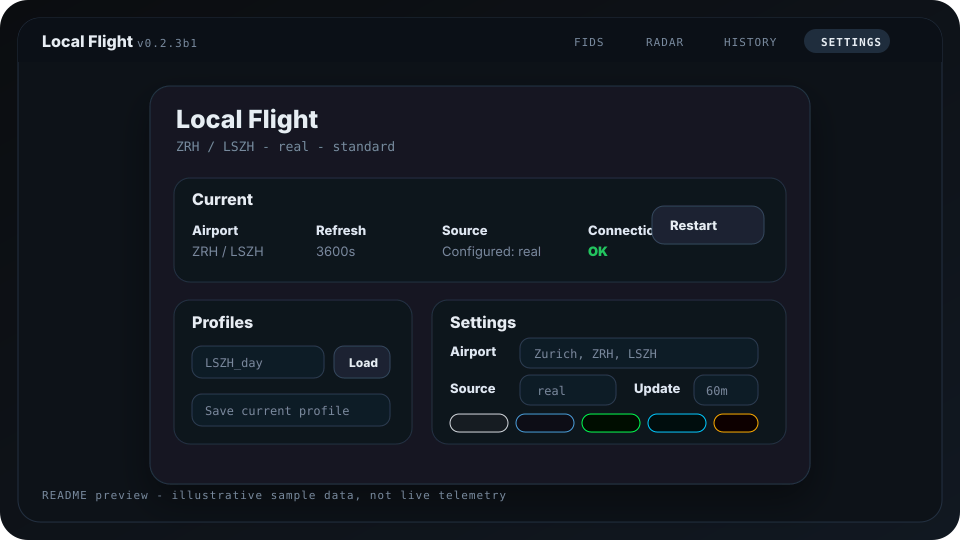
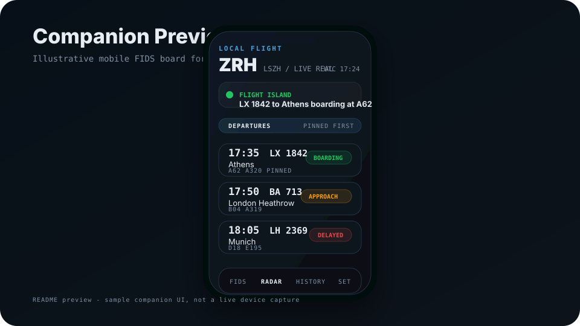
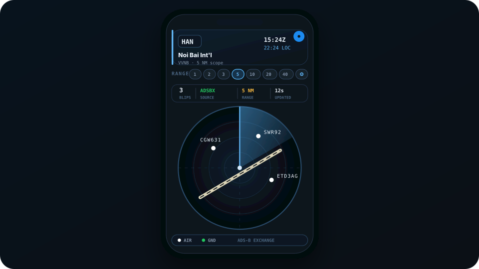
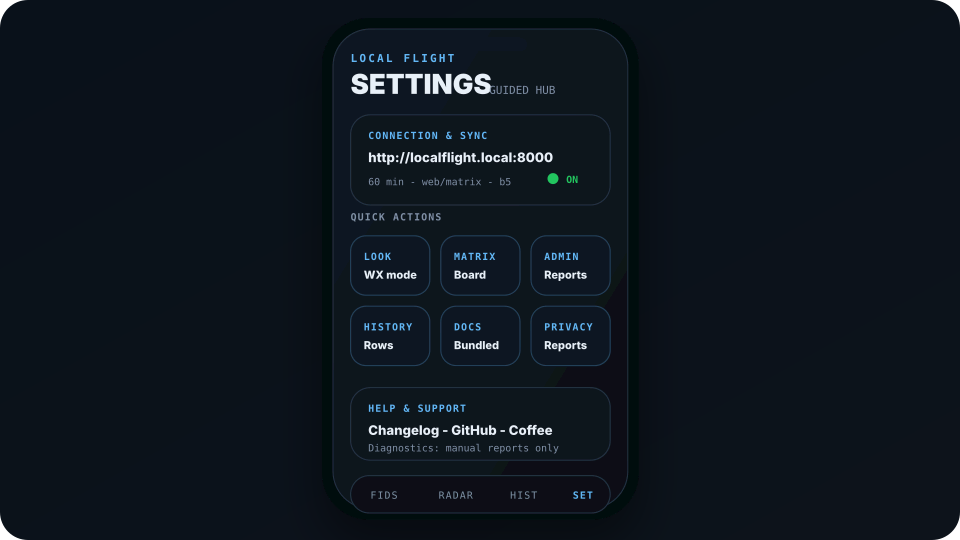

# Local Flight

A **local-first Flight Information Display System (FIDS)** that runs on Windows, macOS, or a Raspberry Pi.
Fetches real and simulated flight data and renders it as a proper airport-style departure/arrival board - in your browser, on an LED matrix panel, or on a dedicated HDMI screen.

No accounts. No signup wall. Community mode can use the hosted relay, but it still stays install-scoped instead of account-scoped.

**Source:** [github.com/tr3y4rch/local-flight](https://github.com/tr3y4rch/local-flight)

---

## What it does

- Three clear setup paths: **Community**, **Bring your own keys**, or **VATSIM**
- Airport-style **FIDS departures / arrivals board** with live WebSocket refresh, flight detail drawer, history, and UTC/local clock
- **Radar view** with ADS-B Exchange enrichment, OpenSky fallback, and METAR weather
- **Split display** mode for FIDS + radar on one screen, plus kiosk-ready desktop and Pi flows
- **Admin hub** for scheduler status, install-local API budgets, connected clients, updates, and diagnostics
- **Diagnostics choice** so each install can stay on manual reports only, automatic crash reports, or automatic crash reports with sanitized logs
- **Profiles** for saving and switching airport presets quickly
- **Mobile companion** beta for LAN viewing and light control from iPhone, iPad, and simulator
- **Interstate 75 W LED matrix support** with a browser preview, safe board-file download, and server-side runtime config

---

## Preview

These are lightweight illustrative previews with sample data, not live telemetry screenshots.

Open [docs/previews/index.html](docs/previews/index.html) locally for the standalone HTML gallery.

<p align="center">
  
  
  
</p>

<p align="center">
  
  
  
</p>

---

## Install

### Windows

1. Download `LocalFlight-windows.zip` from the [latest release](https://github.com/tr3y4rch/local-flight/releases)
2. Unzip to any folder
3. Double-click `LocalFlight.exe`
4. Complete the setup wizard

> Windows SmartScreen may warn "Unknown publisher" - click **More info -> Run anyway**.

The Windows release zip is self-contained. It bundles Python and the app dependencies, so `installers/windows/install.ps1` is only for running Local Flight from a source checkout.

Release builds also produce `LocalFlight-windows.zip.sha256` so the downloaded zip can be verified before running.

### macOS

1. Download `LocalFlight-macos.zip` from the [latest release](https://github.com/tr3y4rch/local-flight/releases)
2. Unzip it
3. Drag `LocalFlight.app` to Applications
4. Right-click -> Open on first launch if macOS Gatekeeper warns about an unsigned app

Release builds also produce `LocalFlight-macos.zip.sha256` so the downloaded zip can be verified before running.

The macOS source installer is only for running Local Flight from a source checkout:

```bash
bash installers/macos/install.sh
```

### Raspberry Pi

Run these from a source checkout on the Pi. The installer creates the venv, `.env`, systemd app service, optional Chromium kiosk service, and mDNS hostname. Add `--kiosk` during install if you want HDMI Chromium on the Pi itself.

```bash
# One-time setup
bash installers/pi/install.sh

# Management
lf start    # start
lf stop     # stop
lf logs     # tail logs
lf update   # pull latest + restart
```

The Pi runs headless - access the UI from any device on your network at `http://localflight.local`.

---

## Mobile companion

The mobile companion is an **iOS-first beta companion** for Local Flight. It is optional, and there is still no App Store, TestFlight, Play Store, or APK release yet.

It runs from the `mobile/` folder with React Native / Expo and connects to the Local Flight desktop or Pi server over your local network. If you only want the main FIDS display, skip this section.

### What works now

- FIDS, radar, history, and settings screens
- WebSocket live sync with fallback polling
- Pinned flights and the Flight Island focus card
- Airport, source, and refresh interval changes against the local server
- Matrix preview helper, admin summary, and feedback / crash reporting
- Companion-specific ID and platform reporting for cleaner diagnostics

### Requirements

- macOS with Xcode for iOS simulator/device testing
- Node.js 20 LTS or newer
- Local Flight already running on the same WiFi/LAN
- The LAN URL of your Local Flight server, for example `http://192.168.1.42:8000`

### Run the companion

```bash
cd mobile
npm install
npx expo install --fix
npm run doctor
npm run ios
```

For a physical iPhone or iPad:

```bash
cd mobile
npm run ios:device
```

In the app settings, enter the Local Flight server's LAN address. Do **not** use `localhost` on a phone; `localhost` means the phone itself, not your Mac or Windows machine.

Android support is planned later; the current companion testing flow is still iOS-first.

---

## First-run setup

On first launch Local Flight briefly shows a versioned splash screen, then opens the setup wizard at `http://localhost:8000/setup`.

It walks through:
1. Airport selection (IATA / ICAO search)
2. How you want to run it:
   - **Community** - uses the hosted shared backend for schedules, limited to 50 requests per 30-day window per install
   - **Bring your own keys** - uses your own AviationStack key for schedules and optional RapidAPI / OpenSky keys for radar
   - **VATSIM** - uses virtual traffic only, with no real-data API key required
3. Optional radar providers:
   - **ADS-B Exchange via RapidAPI** for live positions
   - **OpenSky Network** as a fallback or lower-cost path

The scheduler only starts after setup completes. You can re-run the wizard any time from **Settings -> Re-run setup wizard**.

After the first launch into the main app, Local Flight asks once how you want diagnostics handled. Manual reports always stay available from the **Report** page. Developer reports are forwarded through the hosted relay reporting gateway; Linear credentials are not shipped in the desktop or mobile app.

Community mode defaults to `https://localflight-community-relay.fly.dev/v1/flights`. Only change that relay URL if you are deliberately pointing the client at your own backend.

---

## Data sources

| Source | Key required | Used for |
|---|---|---|
| AviationStack | Optional (`AVIATIONSTACK_API_KEY`) | Flight schedules, gates, status; without a key Local Flight uses the community relay quota |
| ADS-B Exchange | Optional (`RAPIDAPI_KEY`) | Live positions, aircraft type, registration |
| OpenSky Network | Optional (`OPENSKY_CLIENT_ID` / `SECRET`) | Position fallback (anonymous works, lower rate limits) |
| VATSIM | No | Full data source for flight sim / virtual mode |
| aviationweather.gov | No | METAR weather - free, no key needed |

---

## Environment variables (`.env`)

The setup wizard writes these for you. You can also edit `.env` directly — changes take effect on the next fetch without restart.

```
# Community relay / activation
LOCALFLIGHT_ACTIVATION_TOKEN=
LOCALFLIGHT_RELAY_URL=https://localflight-community-relay.fly.dev/v1/flights

# BYOK AviationStack - leave blank to use the community relay instead
AVIATIONSTACK_API_KEY=your_key_here
LOCALFLIGHT_AVIATIONSTACK_ENABLED=1
LOCALFLIGHT_AVIATIONSTACK_MONTHLY_LIMIT=90
LOCALFLIGHT_RELAY_MONTHLY_LIMIT=50

# ADS-B Exchange via RapidAPI - live aircraft positions
RAPIDAPI_KEY=your_rapidapi_key
LOCALFLIGHT_RAPIDAPI_MONTHLY_LIMIT=10000

# OpenSky Network - position fallback (optional)
OPENSKY_CLIENT_ID=your_id
OPENSKY_CLIENT_SECRET=your_secret
```

---

## Configuration

Config lives at `~/.localflight/config.json` and is managed via the **Settings** page at `http://localhost:8000`.

Runtime data is also kept outside the source tree:

- Snapshots: `~/.localflight/storage/data/<IATA>/snapshots`
- History DB: `~/.localflight/history.db`
- Logs: `~/.localflight/logs`
- API usage: `~/.localflight/api_usage.json`

| Field | Default | Description |
|---|---|---|
| `airport_iata` | `ZRH` | 3-letter IATA code |
| `airport_icao` | `LSZH` | 4-letter ICAO code |
| `refresh_seconds` | `3600` | Fetch interval (min 900 s) |
| `source` | `real` | `real` (AviationStack) or `virtual` (VATSIM) |
| `timezone` | `Europe/Zurich` | IANA timezone for local time display |
| `theme` | `dark` | `dark` or `light` |
| `skin` | `standard` | `standard`, `technical`, `neon`, `cyan`, `crt` |
| `display_name` | `Local Flight` | Shown in the UI header |
| `display_outputs` | `["web"]` | `web`, `matrix`, `hdmi` |

---

## Pages

| URL | Description |
|---|---|
| `/splash` | Short launch splash screen with version badge, then redirects to setup/display |
| `/display` | Split-view FIDS + Radar with draggable divider (default on launch) |
| `/fids` | FIDS board standalone (`?view=arrivals\|departures`) |
| `/radar` | Radar standalone |
| `/matrix-preview` | Browser LED matrix simulator, board-file helper, and runtime config surface |
| `/` | Settings - airport, skin, outputs |
| `/admin` | Admin hub - scheduler status, API budgets, connected clients, system info |
| `/admin/requests` | Traffic log - local, anonymized request counters by endpoint/client type (only when network tools are explicitly enabled) |
| `/history` | Flight history - filterable table + aggregate stats |
| `/logs` | Live log viewer |
| `/feedback` | Report a problem - sends directly to the developer |

---

## Skins

| Skin | Style |
|---|---|
| `standard` | Dark/light neutral with pictogram aircraft silhouettes |
| `technical` | Cool blue monospace, radar-style vector icons |
| `neon` | Green phosphor CRT |
| `cyan` | Ops-centre blue |
| `crt` | Amber split-flap |

---

## API call budgets

AviationStack and RapidAPI usage is tracked locally in `~/.localflight/api_usage.json` and resets monthly.

- AviationStack BYOK default: 90 calls/month
- Community relay default: 50 calls/month per install (enforced relay-side, rolling 30-day window)
- ADS-B Exchange / RapidAPI default: 10,000 calls/month
- Each real scheduler cycle normally costs 2 AviationStack calls (departures + arrivals)

Scheduler restarts and config changes do not burn a new schedule call while the current snapshot is still fresh.

---

## Supported hardware

| Device | Role |
|---|---|
| Windows PC | Full desktop app - system tray, Edge/Chrome kiosk window |
| macOS | Full desktop app - system tray, Chrome/Safari kiosk window |
| Raspberry Pi 5 | Headless server - systemd services, Chromium kiosk, mDNS (`localflight.local`) |
| Pimoroni Interstate 75 W | LED matrix display (64x32 up to 384x64) - MicroPython client |
| RTL-SDR USB dongle | Local ADS-B receiver on Pi - no API key or rate limits |
| 7-10" HDMI screen | Secondary display via Chromium kiosk (`hdmi` output mode) |

### LED matrix (Interstate 75 W)

The board connects to your WiFi independently, reads runtime settings from Local Flight, and polls the FIDS API on its own schedule:

- Classic split-flap letter animation
- Button A = departures, Button B = arrivals, A+B = force refresh
- RGB status LED: green = ok, blue = fetching, amber = no data, red = no WiFi
- Browser-side matrix setup page with:
  - server-generated `main.py` download from the canonical board client
  - server-side matrix runtime config (`/api/matrix/config`) for rows, brightness, refresh, and default view
  - host validation so the board is pointed at a LAN host such as `localflight.local`, not `localhost`

For the cleanest path, open `/matrix-preview`, enter the board WiFi details plus the Local Flight server host, download `main.py`, and save it to the MicroPython device with Thonny.

### RTL-SDR / ADS-B on Pi

```bash
sudo apt install dump1090-fa
sudo systemctl enable --now dump1090-fa
```

Provides unlimited local ADS-B reception with no API key or monthly limits.

---

## Reporting issues

Use the **Report** page from the nav bar anywhere in the app. Manual reports are always available. Automatic diagnostics are an install-level choice you can keep off, enable for crash reports only, or enable with sanitized log excerpts. Reports are sanitized locally, forwarded through the hosted relay, deduplicated/rate-limited there, and then filed into the developer's Linear inbox. No account required.

---

## API reference

| Endpoint | Method | Description |
|---|---|---|
| `/api/fids` | GET | FIDS rows (`?view=arrivals\|departures&limit=20`) |
| `/api/fids/detail` | GET | Callsign detail with live position + 7-day history |
| `/api/radar` | GET | Aircraft positions (`?radius_nm=20`) |
| `/api/metar` | GET | Decoded + raw METAR |
| `/api/flights` | GET | Raw flight list from latest snapshot |
| `/api/history` | GET | Recent flights (`?hours=24&direction=dep`) |
| `/api/history/flight` | GET | Callsign history (`?callsign=SWR184&days=7`) |
| `/api/history/stats` | GET | DB row count, size, oldest/newest |
| `/api/history/summary` | GET | Top airlines, routes, aircraft, on-time rate |
| `/api/config` | GET / PATCH | Read or update config |
| `/api/health` | GET | Scheduler state - last fetch, errors, latency |
| `/api/airports/search` | GET | Airport search (`?q=zurich`) |
| `/api/airports/resolve` | GET | Resolve IATA/ICAO to full record |
| `/api/admin/system` | GET | Uptime, memory, CPU, version |
| `/api/admin/budget` | GET | API call budgets and usage |
| `/api/admin/requests` | GET | Anonymized local request log summary (only when network tools are explicitly enabled) |
| `/api/admin/connections` | GET | WebSocket client count + device pings |
| `/api/admin/updates` | GET | Latest GitHub release check |
| `/api/admin/scheduler` | GET | Scheduler thread status |
| `/api/admin/scheduler/restart` | POST | Restart scheduler and run a fresh fetch cycle |
| `/api/admin/ping` | POST | Device ping (LED matrix client) |
| `/api/matrix/config` | GET / POST | Read or update LED matrix runtime settings |
| `/api/matrix/script` | POST | Generate a ready-to-flash Interstate 75 W `main.py` |
| `/api/feedback` | POST | Submit a bug report (`{title, description, client_context}`) |
| `/api/feedback/crash` | POST | Auto-file crash report with deduplication |
| `/api/setup/complete` | POST | Save setup, write `.env`, mark complete |
| `/api/setup/reset` | POST | Re-run setup wizard |
| `/api/setup/test-aviationstack` | POST | Validate an API key without saving |
| `/api/setup/test-rapidapi` | POST | Validate an ADS-B Exchange RapidAPI key without saving |
| `/api/quit` | POST | Graceful shutdown |
| `/ws` | WS | WebSocket push - broadcasts snapshot, config, and scheduler events |

---

## Philosophy

- **Local first** - flight data, history, config, and logs live on your own machine.
- **Private by design** - no accounts, no email, no analytics SDK, no tracking. See [PRIVACY.md](PRIVACY.md).
- **Simple stack** - standard Python, clear modules, predictable behavior.
- **Pi-ready** - nothing in the stack needs a GPU or big hardware.
- **Graceful fallback** - if one enrichment source fails, the next one takes over.
- **Budget-aware** - AviationStack, relay, and RapidAPI counters are enforced in code.
